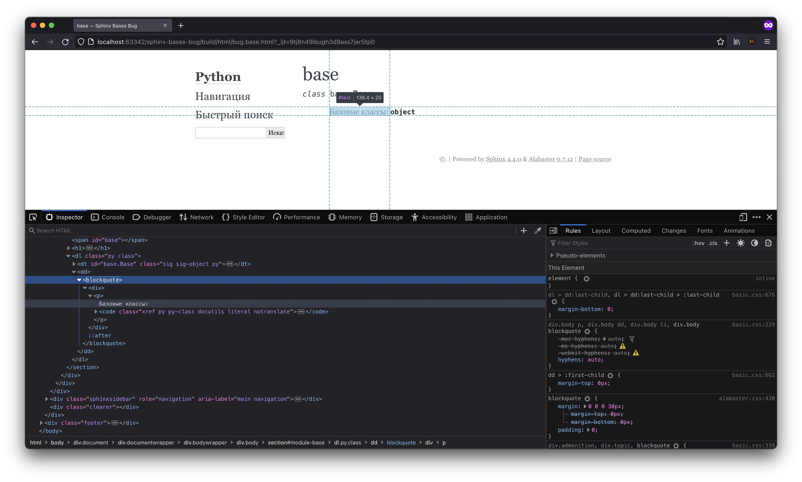
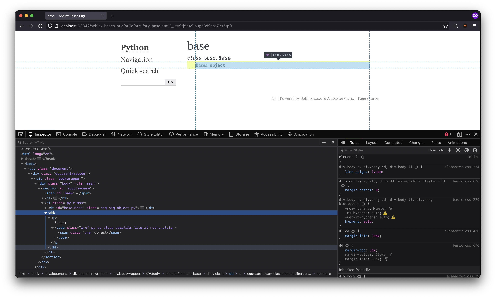
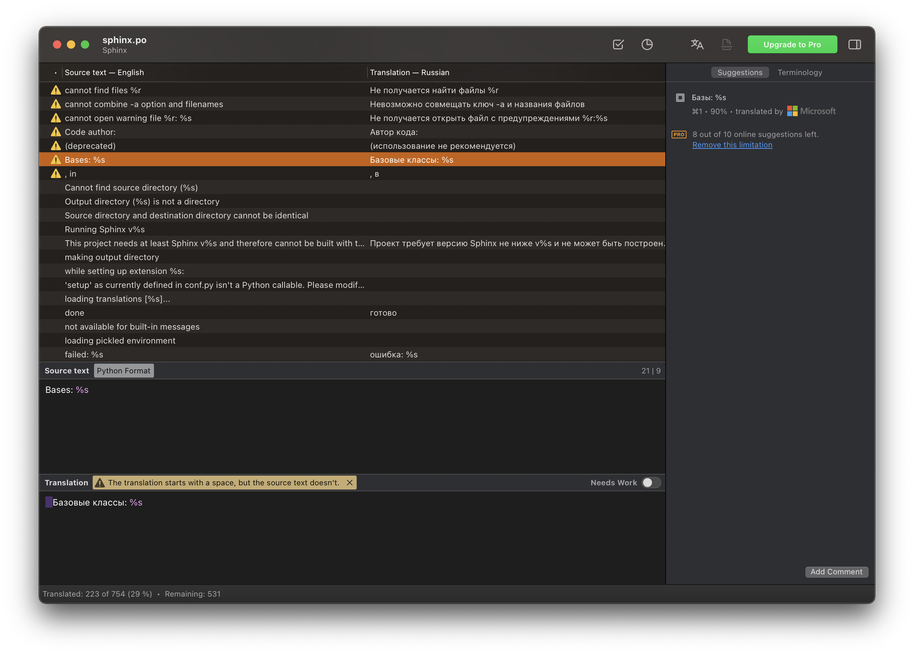

## Sphinx Bases Bug with RU language

Sphinx adding **blockquite** without any reasons as a wrapper for bases.

Is it a big issue? Yeah, when we try to use custom themes it looks awful. Ref: https://github.com/pradyunsg/furo/discussions/378

What the problem? There is extra spaces in gettext locales for RU lang. 

### language = 'ru'

### language = 'en'

### poedit warning

